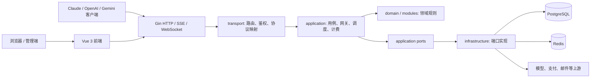

# Sub2API 架构总览

本文描述当前源码中的稳定架构边界，帮助二次开发者先判断“改动应该落在哪一层”。具体接口、字段和分支以源码与测试为准。

## 系统上下文

Sub2API 是一个 Go 模块化单体：同一后端进程同时提供浏览器管理 API、面向客户端的模型网关、后台任务和嵌入式前端资源。PostgreSQL 保存业务事实，Redis 承担缓存、并发协调、队列和短期运行状态。



前端生产构建输出到 `backend/internal/transport/webassets/dist/`，随后嵌入后端二进制。开发模式下，Vite 和 Go 服务可分别运行。

## 后端层级

| 层级 | 路径 | 负责 | 不负责 |
| --- | --- | --- | --- |
| 启动与装配 | `backend/cmd/server/` | 启动模式、Wire 图、生命周期、优雅退出 | 业务规则 |
| Transport | `backend/internal/transport/` | 路由、中间件、DTO、HTTP/SSE/WS 响应 | SQL、Redis 细节 |
| Application | `backend/internal/application/` | 用例编排、网关流程、调度、计费、端口接口 | Gin 路由、具体存储客户端 |
| Domain | `backend/internal/domain/` | 纯领域值与规则 | 网络、数据库、运行配置读取 |
| Modules | `backend/internal/modules/` | 可独立演进的垂直领域 | 无边界的通用 helper |
| Infrastructure | `backend/internal/infrastructure/` | PostgreSQL、Redis、缓存和外部资源端口实现 | HTTP 响应格式 |
| Platform | `backend/internal/platform/` | 配置、安全、限流等运行平台能力 | 产品业务流程 |
| Shared | `backend/internal/shared/` | 低层协议适配和无业务状态工具 | 对上层业务的反向依赖 |
| Bootstrap | `backend/internal/bootstrap/` | 首次启动和升级引导 | 常驻请求逻辑 |

推荐依赖方向：

```text
transport -> application -> domain
                    ^
                    |
infrastructure implements application ports
```

具体实现只应在 `backend/cmd/server/wire.go`、各层 `wire.go` 和生成的 `wire_gen.go` 中完成绑定。`wire_gen.go` 是生成文件，不手工编辑。

## 启动链路

1. `backend/cmd/server/main.go` 判断首次安装、CLI setup 或正常服务模式。
2. `config.LoadForBootstrap` 读取运行配置，初始化日志。
3. `initializeApplication` 使用 Wire provider set 构造 repository、service、handler 和 HTTP server。
4. `backend/internal/transport/http/server/router.go` 安装全局中间件、嵌入式前端和各路由域。
5. 后台 worker 与缓存同步器由 provider/cleanup 生命周期管理；退出时先停止应用任务，再关闭 Redis、数据库等基础设施。

查启动失败时按 `main.go -> wire.go/wire_gen.go -> provider set -> 具体构造器` 追踪。

## HTTP 边界

浏览器管理面和 API Key 网关是两类不同入口：

| 流量 | 典型路径 | 鉴权 | 路由事实源 |
| --- | --- | --- | --- |
| 公共/登录/用户/管理 API | `/api/v1/...` | 公共、JWT、Admin、step-up 等 | `routes/auth.go`, `user.go`, `admin.go`, `payment.go` |
| 模型网关 | `/v1/...`, `/responses`, `/v1beta/...`, 专用平台前缀 | API Key + 分组/订阅约束 | `routes/gateway.go` |
| 健康、就绪与首次设置 | `/health`, `/ready`, `/setup/...` | 依端点而定 | `routes/common.go` 与 bootstrap setup |

路由文件只组合路径、中间件和 handler。handler 负责协议边界；业务选择、调度、上游访问编排和计费进入 application service。

## 数据与状态边界

| 数据 | 事实源 | 说明 |
| --- | --- | --- |
| 用户、账号、分组、订阅、订单、用量 | PostgreSQL | Ent schema 在 `backend/ent/schema/`，版本迁移在 `backend/migrations/` |
| 余额、订阅和 API Key 鉴权投影 | PostgreSQL + Redis 缓存 | 数据库是持久事实，缓存更新必须防止旧快照覆盖新写入 |
| 并发槽位、限流、粘性会话、调度快照 | Redis/进程内短期状态 | 必须有过期、释放、容量上限和故障降级策略 |
| 用量结算队列 | Redis Stream + PostgreSQL 幂等落库 | 关键计费任务不能静默丢弃；Redis 故障时使用受限 fallback |
| 前端运行设置 | 后端注入 + 管理 API | 浏览器状态不是权限或计费事实源 |
| 逻辑节点、期望版本与滚动发布 | PostgreSQL + 节点本地 identity file | PostgreSQL 保存节点别名和发布任务；每个节点本地持久卷保存稳定 `node_id`，进程级 `runner_id` 只作为历史 |

数据库变更必须同时考虑 Ent schema、迁移、repository、DTO/API 兼容和测试 fixture。只改 schema 或只写迁移都不完整。

## 前端结构

前端入口是 `frontend/src/main.ts`。它依次初始化主题、Pinia、后端注入设置、i18n 和 Router，再挂载应用。

| 路径 | 职责 |
| --- | --- |
| `frontend/src/core/routes/` | 路由定义、守卫、标题和 setup 重定向；`index.ts` 是路由事实源 |
| `frontend/src/core/networks/` | Axios client、内存 token、session 刷新、URL 和凭据传输能力 |
| `frontend/src/core/stores/` | 全应用共享的运行状态；当前包括 app 与 onboarding owner |
| `frontend/src/core/i18n/` | i18n 初始化、locale 懒加载和全部用户可见文案 |
| `frontend/src/core/themes/` | 全局样式入口和公告、引导等专题样式 |
| `frontend/src/core/services/`, `constants/`, `utils/` | 应用级服务、常量和无页面归属的基础工具 |
| `frontend/src/common/` | 跨功能复用的页面、widget、composable 和 UI 类型 |
| `frontend/src/features/<domain>/data/datasources/` | 领域请求协议、响应类型和 API 调用 |
| `frontend/src/features/<domain>/presentation/` | 领域 page、widget、composable 和 Pinia store |
| `frontend/src/types/` | 多个 feature 仍共享的协议类型与全局类型声明 |

前端的主调用方向是：

```text
main / core routes
  -> feature presentation
  -> feature data datasource
  -> core networks
  -> backend

feature presentation -> common + core services/stores/utils
```

页面、领域组件、交互、Store 和 API 默认跟随 `features/<domain>` 的 owner。跨业务的展示与交互能力进入 `common`；应用级组合与运行能力进入 `core`。Router 作为组合入口可以懒加载 feature page，`main.ts` 只连接 Pinia、公开设置、i18n、Router 和主题。

复杂 feature 页面继续按 `page -> widget -> composable/resolver` 收敛：page 保留路由级加载、保存和生命周期，widget 承担领域表单、表格与 tab/panel，composable/resolver 承担可复用状态和纯转换。feature 内的源码拆分使用静态 import，确保仍归入原路由 chunk；不得用动态组件或全局 Store 仅为缩短文件而改变挂载、请求或分包语义。

前端非测试运行时 TypeScript/Vue 模块执行 1500 有效行硬门禁。超限代码必须在所属 feature 内按职责拆分，不能通过格式压缩、跨层搬运或扩大兼容 barrel 绕过。

`frontend/src/api/index.ts`、`frontend/src/api/admin/index.ts` 和 `frontend/src/stores/index.ts` 仅保留旧导入的过渡兼容导出。它们不拥有业务实现；新代码应直接导入所属 feature datasource/store 或 core 模块，避免迁移期 barrel 重新变成长期公共层。为保证滚动升级和平滑迁移，在旧导入全部替换且回归验证通过前保留这些导出。

## 关键不变量

- 鉴权、余额、订阅和并发准入必须在后端执行；前端只做体验层提示。
- 等待并发槽位后要重新检查计费资格，避免排队期间状态变化造成越权请求。
- 所有已获取的用户/账号/图片并发槽位必须在成功、错误和客户端取消路径释放。
- 流式响应一旦写出状态或事件，错误必须使用对应协议格式，不能退回普通 JSON 状态码。
- 调度失败处理必须维护失败账号集合和最大切换次数，避免在坏账号上无限重试。
- 用量记录以 request ID/指纹保证幂等，结算成功后再更新相关缓存投影。
- 生产前端必须通过统一构建路径嵌入，不能手改 `webassets/dist/`。

## 扩展决策

新增功能前按以下顺序判断：

1. 只是新协议入口：在 routes/handler 增加适配，复用已有 application 用例。
2. 是现有业务的新用例：在对应 application service 前缀下按职责拆文件。
3. 有独立状态、策略和外部接口：建立 `internal/modules/<domain>`，通过小端口接入。
4. 是多个领域都需要的无状态协议工具：放入 `internal/shared/<topic>`。
5. 是存储或外部调用实现：在 infrastructure 实现 application 端口。

更具体的文件定位见 [代码地图](CODE_MAP.md)，运行顺序见 [关键请求链路](REQUEST_LIFECYCLES.md)。
