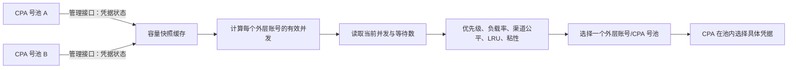

# CPA 多号池动态负载分配说明

本文档说明 Sub2API 当前如何感知多个 CLIProxyAPI（下文简称 CPA）号池的可用容量，并在 Sub2API 调度层动态调整请求分配。

## 1. 能力边界

当前实现包含两层调度：

1. Sub2API 在多个外层 API Key 账号之间选择一个账号。一个开启“CPA 并发联动”的外层账号应对应一个物理 CPA 号池。
2. 请求进入选中的 CPA 号池后，由 CPA 自己选择池内的具体凭据。

因此，Sub2API 能调整“请求进入哪个号池”，但不会直接指定 CPA 使用池内的哪个凭据。

这是一种按容量和实时利用率进行的动态调整，不是严格实时、严格按比例的全局负载均衡。容量变化通常最多有 90 秒感知延迟；优先级、渠道公平、会话粘性和账号运行状态也会影响最终选择。

## 2. 调度流程



对每个开启 CPA 并发联动的外层账号，Sub2API 请求 CPA 管理接口：

```text
GET {CPA 管理地址}/v0/management/auth-files
Authorization: Bearer {CPA 管理员密码}
```

这里使用的是 CPA 配置中的 `remote-management.secret-key`（环境变量通常为 `MANAGEMENT_PASSWORD`），不是用于 API 转发的 `sk-...` API Key。底层存储字段仍叫 `cpa_management_key`，仅用于保持已有配置兼容。

管理地址默认跟随账号 Base URL，也可以为该账号单独指定。系统兼容根地址、以 `/v1` 结尾的转发地址、`/v0/management` 和完整的 `/v0/management/auth-files` 地址，并统一请求 CPA 管理接口。

## 3. 凭据统计与有效容量

### 3.1 统计口径

容量快照始终保留以下原始统计：

- 启用凭据：`disabled` 不为 `true`，并且 `status` 忽略大小写后不等于 `disabled`；
- 异常凭据：启用凭据中，`status=error` 或 `unavailable=true` 的凭据；
- 健康可用凭据：`max(0, 启用凭据数 - 异常凭据数)`，用于展示上游健康标记，不一定直接参与并发计算。

`next_retry_after` 不改变上述异常统计口径。

### 3.2 有效并发

“从并发容量中排除异常凭据”是独立账号策略，默认关闭。计入并发的凭据数按以下规则派生：

```text
开关关闭（默认）：计入并发凭据数 = 启用凭据数
开关开启：计入并发凭据数 = 健康可用凭据数
```

有效并发公式为：

```text
有效并发 = 计入并发凭据数 × 单凭据折算并发
```

默认不扣除异常凭据，是因为 CPA 上游的 `status=error` 或 `unavailable=true` 可能误标仍可正常转发的凭据。只有运维确认上游异常标记可靠并主动开启策略后，这些凭据才会从容量中排除。

CPA 联动开启后，这个有效并发完全替代管理员设置的账号并发，不再与其取最小值。管理员设置的原始并发只作为关闭 CPA 联动后的备用值。

示例：

| 号池 | 启用凭据 | 异常凭据 | 排除异常 | 计入并发凭据 | 单凭据折算并发 | 有效并发 |
| --- | ---: | ---: | --- | ---: | ---: | ---: |
| A | 20 | 2 | 关闭 | 20 | 2 | 40 |
| B | 5 | 0 | 关闭 | 5 | 2 | 10 |
| C | 20 | 2 | 开启 | 18 | 2 | 36 |

池内没有启用凭据、开启排除策略后计入并发凭据数为零，或者无法获得容量快照时，该外层账号会从本次候选中排除。

## 4. 动态负载分配

调度器为候选账号批量读取 Redis 中的当前并发和等待数量，并计算：

```text
负载率 = (当前并发 + 等待数量) × 100 / 负载因子
```

未手工设置 `load_factor` 时，负载因子使用前述有效并发。相同优先级下，调度器优先尝试负载率更低的号池。

以上表示例中的 A、B 两池为例，如果它们的分组、平台、优先级和其他调度条件相同，并且没有手工负载因子或粘性会话干扰，调度器会让两池的利用率趋于接近。稳定负载下，A 的承载量通常会接近 B 的 4 倍，但不保证每个短时间窗口都严格达到 `4:1`。

账号选择的主要顺序是：

1. 模型、端点能力、账号状态、运行时封禁等硬过滤；
2. 优先级，数值更小的优先级先使用；
3. 相同优先级内比较负载率；
4. 同负载等级下考虑 API Key 渠道公平和最近最少使用；
5. 会话粘性等兼容策略可能优先复用已经绑定的账号。

## 5. 推荐配置

要让多号池按容量动态分配，建议遵守以下约束：

### 5.1 一个物理池对应一个外层账号

不要让多个 Sub2API 外层账号指向相同的 CPA 管理地址和管理员密码。相同管理地址与密码会共享同一份容量快照，但每个外层账号仍会被当成独立容量参与调度，可能重复计算物理池容量并导致过量准入。

### 5.2 保持调度条件一致

需要共同分担流量的账号应满足：

- 位于相同分组；
- 使用相同平台；
- 使用相同优先级；
- 具备相同请求所需的模型和端点能力。

优先级不是容量权重。数值更小的优先级会优先使用，只有高优先级池饱和、被排除或不兼容时，才会进入下一优先级。

### 5.3 通常不要设置 `load_factor`

手工设置为正数的 `load_factor` 会优先于动态有效并发参与负载率计算，从而屏蔽号池容量变化对调度权重的影响。动态并发仍约束实际槽位获取，因此错误的手工负载因子还可能增加无效尝试或等待。

只有确实需要人为偏置流量时才设置 `load_factor`；需要按 CPA 实际容量自动调整时应将它留空。

### 5.4 正确设置单凭据折算并发

`cpa_concurrency_per_credential` 表示一个计入容量的凭据可承载的并发数，允许范围为 `1` 到 `10000`，默认值为 `10`。已有显式配置保持不变。应依据上游真实限制和稳定性设置，不应仅为了提高表面容量而调大。

## 6. 管理后台配置

CPA 并发联动只支持 API Key 类型账号。在管理后台编辑账号时：

1. 打开“CPA 并发联动”。
2. 选择管理地址跟随账号 Base URL，或填写独立的绝对 HTTP/HTTPS 管理地址。地址不能包含用户信息、查询参数或 fragment。
3. 填写“CPA 管理员密码”。
4. 设置“单凭据折算并发”，默认值为 `10`。
5. 按需开启“从并发容量中排除异常凭据”；默认保持关闭，避免上游误标导致渠道并发归零。
6. 点击“连接测试”，用当前表单中尚未保存的地址、密码、折算并发和异常排除策略执行只读检查。
7. 将需要共同分流的账号调整为相同优先级，并清除手工负载因子。

账号列表的容量列会显示 CPA 有效并发，并在下一行显示“计入并发凭据 N”。旧快照仍显示最后数量并标记为过期；无快照时显示“计入并发凭据 --”；确认容量为零时显示“计入并发凭据 0”。原始账号并发只在提示中作为关闭 CPA 后的备用值。已开启 CPA 的账号可从“更多”菜单点击“同步 CPA”强制获取新快照。

底层凭据字段为：

| 字段 | 含义 |
| --- | --- |
| `cpa_mode` | 是否启用 CPA 并发联动 |
| `cpa_management_url` | 可选的 CPA 管理接口地址；缺省时跟随账号 `base_url` |
| `cpa_management_key` | CPA 管理员密码，字段名为兼容旧配置而保留 |
| `cpa_concurrency_per_credential` | 单个计入容量的凭据折算并发数 |
| `cpa_exclude_abnormal_credentials` | 是否从并发容量中扣除 CPA 标记的异常凭据；缺省或 `false` 时不扣除 |

管理员密码属于敏感凭据，不会由账号响应回传，也不应写入日志、公开配置、工单截图或文档示例。

批量编辑仅在全部目标都是 API Key 账号时显示 CPA 区域。外层复选框决定本次是否修改 CPA，内层开关决定统一启用或关闭。启用时可让每个账号跟随自己的 Base URL，或使用统一管理地址，并可统一设置是否排除异常凭据；管理员密码留空会逐账号保留原密码，没有旧密码的账号会单独失败，不影响其他账号。关闭时删除五个 CPA 专用字段，不影响其他凭据。

管理 API 提供两个只读/容量操作：

- `POST /api/v1/admin/accounts/:id/cpa/test`：测试未保存的地址、管理员密码、折算并发和异常排除策略，不修改账号或容量缓存；密码留空时使用已保存密码。
- `POST /api/v1/admin/accounts/:id/cpa/sync`：仅对配置完整且已启用 CPA 的账号强制刷新容量；失败时保留旧快照供调度降级。

## 7. 缓存、超时与故障行为

| 项目 | 当前行为 |
| --- | --- |
| 正常容量快照有效期 | 90 秒 |
| 失败后的旧快照最长使用时间 | 180 秒 |
| CPA 管理请求超时 | 2 秒 |
| 管理响应读取上限 | 2 MiB |
| 并发刷新合并 | 相同管理地址与管理员密码使用 singleflight 合并 |
| HTTP 重定向 | 不跟随 |

典型故障行为：

| 场景 | 调度结果 |
| --- | --- |
| 首次读取管理接口失败，没有旧快照 | 排除该 CPA 外层账号 |
| 已有快照，刷新失败且快照未超过 180 秒 | 临时继续使用旧容量 |
| 旧快照超过 180 秒且刷新仍失败 | 排除该 CPA 外层账号 |
| 启用凭据数为 0 | 排除该 CPA 外层账号 |
| 全部启用凭据被标记异常，异常排除策略关闭 | 仍按全部启用凭据计算容量，不会因异常标记归零 |
| 异常排除策略开启，计入并发凭据数为 0 | 排除该 CPA 外层账号 |
| 管理响应不是 HTTP 200，或无法在 2 MiB 读取上限内解析 | 视为容量读取失败 |

失败时后端会记录 `cpa_pool_capacity_unavailable` 警告，其中包含外层账号 ID、管理地址和错误，但不会记录管理员密码。

## 8. 渠道公平与会话粘性

OpenAI 兼容 API Key 账号还会按标准化后的上游 `base_url` 识别渠道。在优先级和负载等级相同的候选中，调度器会交错不同渠道，避免某个渠道仅因外层账号数量更多而天然占据全部选择位置。

这意味着：

- 多个 CPA 号池使用不同上游地址时，渠道公平可能影响短时间内的精确容量比例；
- 多个账号使用相同标准化上游地址时，它们属于同一渠道，但账号级负载率仍会参与选择；
- 开启或命中会话粘性时，同一会话可能继续使用原号池，直到账号不再可用或粘性策略允许逃逸。

因此，容量比例用于控制长期承载能力，不应被理解为逐请求的固定轮询比例。

## 9. 运维检查

### 9.1 检查 CPA 管理接口

在有权限的运维环境中请求管理接口，确认返回 HTTP 200 且包含 `files` 数组：

```bash
export CPA_POOL_URL='https://cpa.example.com'
export CPA_POOL_MANAGEMENT_PASSWORD='replace-with-secret'
curl -fsS \
  -H "Authorization: Bearer ${CPA_POOL_MANAGEMENT_PASSWORD}" \
  -H 'Accept: application/json' \
  "${CPA_POOL_URL}/v0/management/auth-files"
```

不要把带有真实管理员密码的命令历史或输出提交到仓库。生产环境应使用 HTTPS；HTTP 会以明文传输管理员密码，只适合可信隔离网络中的临时诊断。

### 9.2 检查分流配置

逐个确认参与分流的外层账号：

- 是否为 API Key 类型并处于可调度状态；
- `cpa_mode` 是否启用；
- `cpa_exclude_abnormal_credentials` 是否开启；
- 管理地址和管理员密码是否对应正确的物理池；
- 分组、平台和优先级是否一致；
- `load_factor` 是否为空；
- 容量列的有效并发和计入并发凭据数是否符合预期；
- 模型、端点能力和渠道限制是否使某个池无法进入候选。

### 9.3 判断是否正常动态调整

1. 记录各池当前启用、异常、健康可用、计入并发凭据数和计算出的预期有效并发。
2. 使用持续并发请求观察各外层账号的当前并发与等待数，而不是只比较累计请求数。
3. 等待至少一个 90 秒容量刷新窗口后，再判断增减 CPA 凭据是否已经反映。
4. 比较各池负载率是否趋近，而不是要求累计请求数绝对相等。
5. 若同一内容或同一会话持续集中到一个池，检查会话粘性，不要先把它误判为容量同步失效。

## 10. 已知限制

- 容量来自 CPA 管理接口的周期快照，不是推送或逐请求实时数据。
- 当前只同步凭据状态并计算启用、异常、健康可用和计入并发数量，不会读取每个凭据不同的限额、RPM、余额或实际并发能力。
- 所有凭据使用同一个 `cpa_concurrency_per_credential` 折算值。
- Sub2API 不掌握 CPA 池内的最终选凭据算法和池内排队情况。
- 手工负载因子、硬优先级、渠道公平、会话粘性和请求能力过滤都会使短期分布偏离容量比例。
- 多实例 Sub2API 的容量快照是进程内缓存；各实例的刷新时刻可能不同，但每个实例都遵守相同的有效期和失败策略。

## 11. 实现位置

- CPA 配置校验、容量请求、缓存和有效并发计算：`backend/internal/application/service/cpa_pool_capacity.go`
- CPA 连接测试、主动同步与运行时容量响应：`backend/internal/transport/http/handler/admin/account_cpa_handler.go`
- CPA 批量敏感凭据合并：`backend/internal/application/service/admin_account.go`
- OpenAI 调度前应用 CPA 容量：`backend/internal/application/service/openai_gateway_scheduling.go`
- 通用网关调度前应用 CPA 容量：`backend/internal/application/service/gateway_scheduling.go`
- 账号负载因子回退逻辑：`backend/internal/application/service/account.go`
- Redis 并发、等待数和负载率计算：`backend/internal/infrastructure/repository/concurrency_cache.go`
- OpenAI API Key 渠道交错：`backend/internal/application/service/openai_channel_balancer.go`
