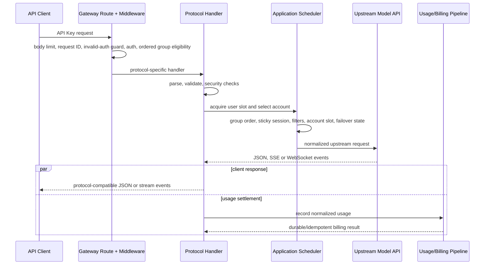
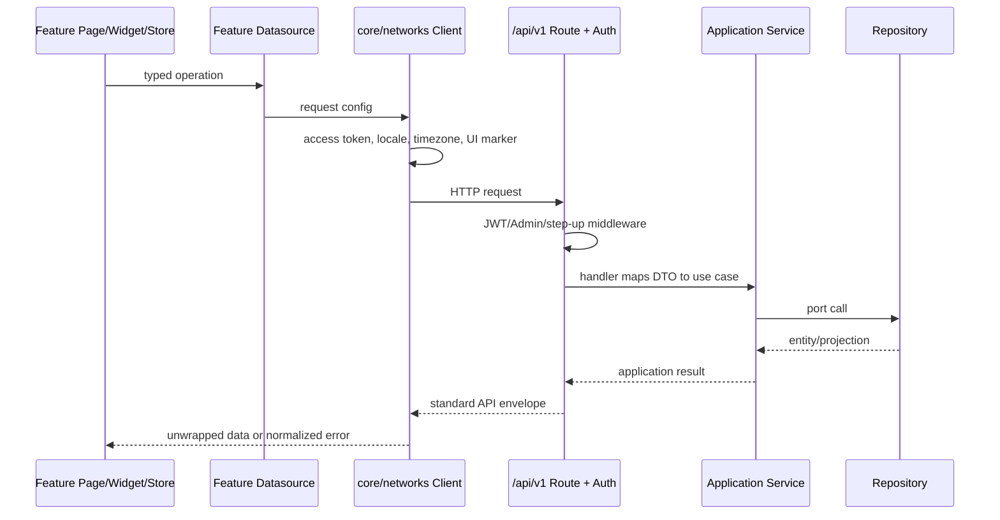

# Sub2API 关键请求链路

本文给出高频链路的阅读顺序和不变量。它刻意省略平台内部的全部分支；调试具体问题时，应从命中的路由和 handler 继续追踪。

## API Key 模型请求

典型入口包括 `/v1/messages`、`/v1/responses`、`/v1/chat/completions`、`/v1beta/...` 以及无 `/v1` 的兼容别名。所有绑定在 `backend/internal/transport/http/server/routes/gateway.go`。



流式事件可能在最终用量结算前已经发送给客户端；这也是结算必须可恢复、幂等且不能依赖客户端连接继续存活的原因。

### 账号级质量监控与降智分组切换

管理员在独立的 `/admin/account-quality` 保存质量策略并启用质量巡检，可指定 `source_group_id` 作为检测源；后台复用账号测试的真实上游传输路径，按
`interval_minutes` 对账号执行两个可独立开关的阶段：`stage1_enabled` 开启糖果形状/口味保证题（默认 `stage1_answer=21`），`stage2_enabled` 开启 SVG 鹈鹕骑自行车画图题并交给渲染分类器。管理员可编辑 `stage1_prompt`、`stage1_answer` 和 `stage2_prompt`。只运行启用的阶段；全开时先文字题再画图。答案必须匹配配置答案且画图分类为 `normal` 才算通过。答错、画图为 `unnormal` 或第一阶段 reasoning token 低于阈值显示为 `degraded`；`failure_threshold` 决定连续失败几轮后自动切组，恢复遵循 `recovery_threshold`。请求或分类错误不递增失败计数。选择检测源分组后只探测该分组账号；已经切入降智分组的账号仍会继续探测以支持恢复。未配置检测源时扫描全部支持的平台账号。账号健康巡检在 `/admin/account-inspection` 使用独立设置、状态和调度器，两个入口互不触发。

配置 `degraded_group_id` 后，首次进入降智状态会先把原 `account_groups` 列表写入账号
`extra.account_quality_original_group_ids`，再通过现有 `BindGroups` 事务绑定目标分组并写 scheduler
outbox。目标分组必须存在、启用且与账号平台一致；切换失败不会静默修改原分组。连续通过达到
`recovery_threshold` 时，仅当账号仍停留在记录的降智分组，系统才恢复原分组；管理员在此期间手动
改组则保留手动结果。未配置目标分组时质量状态仍可观测，但不改变调度资格。

质量监控最多并发 4 个探测。第一阶段使用 `timeout_seconds`（默认 120 秒，可由管理员设置为 30–300 秒）；第二阶段的该值只限制“尚未收到任何流式内容”的等待时间。OpenAI 画图探测使用 Responses 流式请求，收到首个内容/图片事件后不再触发这项短超时，继续等待上游完成；整个质量运行仍受外层运行预算约束。传输、鉴权或无输出超时错误显示为本次 `error`，但不递增质量失败计数，也不触发降智分组切换。第一阶段从上游实际 usage 提取 reasoning token：OpenAI Responses 的 `response.usage.output_tokens_details.reasoning_tokens`、Chat Completions 的 `usage.completion_tokens_details.reasoning_tokens`，Gemini 的 `usageMetadata.thoughtsTokenCount`。缺失用量显示未知；启用阈值时该次结果为待确认，不按 0 判降智。`min_reasoning_tokens` 默认 0（仅展示），管理员可设置 0–1000000；严格小于阈值判为降智，等于阈值通过。摘要提供 0–49、50–99、100–249、250–499、500–999、1000+ 六个区间、均值、已测和未知数量；汇总在分页和截断前完成。状态、连续计数和最近 24 次阶段摘要存入 `accounts.extra`，探测不写入用量日志；公开页仅展示下文列出的最终回答，不展示推理正文。

渲染与分类默认由后端内嵌 `modules/qualityrender` 模块执行：工作脚本与 `best.pt` 随二进制嵌入，主 Docker 镜像在构建时安装 Python、Chromium、Playwright 和 Ultralytics **8.4.14** CPU 运行时。调用通过本地子进程标准输入/输出完成，不监听端口，也不要求修改 Compose、环境变量或持久设置。已有非空 `ACCOUNT_QUALITY_RENDERER_URL` 继续使用原 HTTP 路径。

每次渲染使用独立临时目录和最小环境；Chromium 使用离线模式、CSP 与外部请求阻断，固定 896×672 画面采样 16 帧，`best.pt` 对第 0、7、15 帧执行实际分类，仅输出 PNG/WebP、标签、置信度与版本。结构合法的 SVG 不等同于分类通过。每实例仅启动一个渲染进程，渲染/分类限时 90 秒，任务取消会终止进程组；输入限制 1 MiB、图片各 4 MiB。模型 SHA-256 为 `96bc1abf360ffba879310a0c5d4b4d9d70027083358999ed9fd3daba84fae2b6`。公开接口不返回可执行 SVG。

手动调用 `/api/v1/admin/account-quality/run` 会立即返回 `running` 状态；后台继续执行并持久化 `progress.total/completed/running/queued` 和各账号 `quality_phase`（排队、文字题、绘图生成、渲染分类、保存、完成或中断），管理页每 5 秒轮询展示总任务进度和账号级阶段进度。调度触发仍使用同一质量运行器并等待完整结果。开启 `quality_public_enabled` 后，匿名页 `/monitor/quality/public` 读取
`GET /api/v1/account-quality-share`，按 manxue.ai 风格展示 24 小时摘要、可点击状态时间线、检测对话/响应 ID、两阶段最终回答文本、reasoning token 和图片预览；回答只保留最多 16 KiB 并在前端按纯文本渲染，不返回账号 ID、凭据或原始请求。图片由
`GET /api/v1/account-quality-share/image/:id?format=png|webp` 提供，并限制 24 小时保留。历史记录如果没有对话详情会显示“上游未返回”，不会伪造 ID。

### 阅读顺序

1. `routes/gateway.go`：确认实际命中路径、middleware 顺序和平台分流。
2. `server/middleware/api_key_auth.go`：确认 API Key、用户、分组和订阅如何进入 context。
3. 协议 handler：Anthropic 从 `gateway_handler_messages.go`，OpenAI Responses 从 `openai_gateway_responses.go` 开始。
4. `application/service/gateway_scheduling.go` 或 `openai_account_scheduler.go`：确认候选账号和会话粘性。
5. 对应 `gateway*_forward*` / `openai*_forward*`：确认上游请求与响应转换。
6. `gateway_usage_billing.go` 或 `openai_gateway_usage.go`：确认用量解析和计费提交。

### 蒸馏分组轻量链路

管理员将分组的 `is_distillation_group` 设为 `true` 后，对 Anthropic OAuth/SetupToken 和
OpenAI OAuth 账号启用该链路。网关会删除请求体中的 `prompt_cache_key`、`prompt_cache_retention`、
`cache_control` 及代理生成的缓存断点；每个分组/账号的请求计数按 10000 个逻辑请求划分
session ID 窗口，同一窗口内的重试状态复用同一个合成 session ID。蒸馏链路不读取或保存
上游 session 缓存对象。

蒸馏分组只执行一次上游请求：跳过传输重试、指数退避、thinking/budget/tool 错误修正、账号
failover 和 fallback 分组；失败时立即返回协议兼容错误。鉴权、计费准入、槽位释放、取消处理、
用量幂等写入和 HTTP/SSE/WS 终止事件仍然执行。普通分组继续使用既有缓存、重试和 failover 规则。

### Claude Code -> OpenAI 会话信号

OpenAI 兼容入口的会话键按以下顺序解析：显式 `session_id`/
`conversation_id` 及 `X-Claude-Code-Session-Id`，请求体
`prompt_cache_key`，再到 Claude Code 的 `metadata.user_id` /
`metadata.session_id` 身份信号。Claude Code 元数据优先于内容派生 fallback；因此同一会话在
系统提示、工具或消息尾部变化时仍保持账号粘性。对 OpenAI OAuth 的原生
`/v1/responses` 请求，如果客户端只提供 Claude 元数据，网关会生成一个稳定、独立
命名空间的 `prompt_cache_key`，不向任意 API-key 兼容网关强行注入未知字段。若某次
请求因上游容量/传输等 request-scoped 错误临时切换账号，当前请求可以由备用账号完成，
但后续轮次仍保留原粘性账号绑定；只有账号级不可用状态才清理该绑定。

高并发时，健康的粘性账号先使用其有限等待队列；只有队列已满才允许请求溢出到
负载均衡层，避免短暂的槽位竞争造成缓存冷启动和非预期切号。OpenAI OAuth 候选在
有界 Top-K 内遇到相同负载时使用请求级随机平局，避免固定低编号热集；批量负载快照
若将所有账号判为满载会先执行一次无缓存刷新，再创建兜底等待计划。

管理端 `/admin/ops/concurrency-snapshot` 同时返回 OpenAI 显式 session ID 的当前分钟
首次观测去重增长量（同一 session ID 在 1 小时内不重复计数）：平台、分组和账号行提供 `session_id_growth_per_minute`，响应级
`session_id_growth` 提供筛选范围内总增速和最大账号增速。该指标只保存在进程内短期内存，
按 UTC 分钟轮换，不进入用量聚合、账单或持久化表；内容派生会话不计入该指标。

系统设置的“OpenAI Session ID 每分钟限速”开关对应
`openai_session_id_rate_limit_enabled`，启用后按
`openai_session_id_rate_limit_per_minute` 对每个 OpenAI OAuth 账号的新增显式 Session ID 做
Redis 原子限速；OpenAI API Key 账号不经过该限速；0 表示不限制。达到上限的 OAuth 账号
从本次候选中排除，已有 Session ID 不重复消耗额度。

OpenAI Responses 请求在首个语义事件前使用
`gateway.openai_first_output_timeout_seconds`（默认 90 秒；
`high/xhigh/max` 可由 `gateway.openai_high_effort_first_output_timeout_seconds`
单独设置，默认 180 秒）。`response.created`、`response.in_progress`、
`codex.rate_limits`、`codex.response.metadata` 和 SSE 注释心跳不计作语义输出，
也不因配额或元数据帧而禁用首输出保护；超时会关闭当前上游连接。OpenAI LLM 的
HTTP Responses 请求在尚未提交语义字节、且错误允许重试时继续排除失败账号，直到成功或
可调度号池耗尽，不再受首输出一次切号和普通最大切号数的提前截断；透传路径每个已选择
账号最多四次 transport attempt，重选同账号不补充预算。非流式、图片及其他入口保持原预算。
HTTP SSE 等待响应头（包括换号后的等待）及响应体期间按
`gateway.stream_keepalive_interval` 发送注释心跳，换号和响应头/体阶段切换不重置保活时钟；
账号尝试的前导事件和普通响应头保持私有；若 keepalive 先提交 200，安全元数据改走 trailer，
因此仍可在同一下游连接内无感换号。该策略覆盖
原生 HTTP、HTTP 透传、WSv2 正式请求及其预热；显式设为
`0` 可关闭这项语义首输出保护；各 transport 仍有自己的响应/读超时约束，
但会重新暴露客户端长时间无真实输出后断流的风险。
WSv2 在首语义输出前耗尽内部重连预算时，会把读取/连接类失败转换为统一的
账号 failover 信号；不会落到通用 `Upstream request failed`，也不会重放已经提交的语义事件。

HTTP Responses 流中的显式 `server_error` 在首语义输出前进入既有有界恢复流程，
中间失败事件不向客户端提交；确定性的上下文或策略拒绝仍保留原语义。
恢复成功时，客户端在原连接收到成功账号的流。已输出内容后发生的失败不重放请求；
完整失败事件一旦写出即结束该流，不再转发失败后的心跳、`response.in_progress` 或重复失败。

普通透传请求的传输重试使用请求级总 attempt budget；上述流式号池恢复则按每个已尝试
账号累计预算，两者都不因重选同账号而补充预算。显式
`store:true`、图片生成、`previous_response_id` 或工具输出请求不做无法证明幂等的重放。
keepalive 已提交 200 后，安全响应元数据走预声明的 HTTP trailer，Codex turn state
同时写入账号隔离的会话状态并在后续 OAuth 请求回注。流设置采用 stale-while-revalidate，
设置库慢或不可用不会阻塞转发；可重试 transport timeout 只有在预算耗尽后才建立账号 runtime block，
成功恢复时仅清理同一原因的 block。

Codex Desktop 新建委派任务或启动定时任务时，首轮可能注入没有 `call_id` 的合成
`function_call_output`，其 `id` 使用 `fco_*` item 标识。HTTP 与 WS ingress 会在普通工具输出
校验前对已验证的 delegation/automation 信封做窄范围转换，将其原位恢复为 user message；
不得把 `fco_*` item `id` 伪造成 `call_id`。其他工具输出仍必须携带可与真实调用上下文配对的
`call_id`，未知或含歧义调用上下文的输入不会进入该兼容分支。

### Claude Messages 的上下文控制与 Compact

`/v1/messages` 与 `/v1/responses` 是两条独立的兼容链路。OpenAI 目标的
`/v1/messages` 会先解析 Anthropic 请求，再转成 Responses；只支持 Chat Completions
的账号走直接 Messages→Chat 转换。Anthropic 原生出口保留
`context_management`/`anthropic-beta`，而 OpenAI 兼容出口在下游没有等价字段时，
会在转换前消费 Claude Code 的 `context_hint`、工具结果清理和 thinking 清理策略，
避免这些控制字段静默丢失。

Claude Code 的 compact user turn 在 Responses 兼容出口和 Chat-only 出口都单独处理：
过长 transcript 先分块摘要，再合并为一个 Anthropic assistant 文本响应；流式客户端
仍收到标准 `message_start`/`content_block_*`/`message_stop` 事件。Responses 的
`compaction_trigger`/`compaction` item 仍属于另一条 `/v1/responses` 远程 Compact
协议，不能用普通 Messages 响应替代。

Responses → Anthropic 的 Claude Code `Read` 工具参数在完整 JSON 可解析后做窄范围兼容清洗：
`pages: ""` 和明显超出实际文件行号范围的异常超大 `offset` 会被省略，普通 offset、合法
`pages` 值以及其他工具参数保持原样。这样可以避免 GPT-5.5/5.6 偶发生成的污染参数进入
Claude Code 下一轮上下文并触发重复 Read；网关没有文件长度信息，因此不会猜测或改写为另一个
具体行号。历史 assistant `tool_use` 回放也使用同一清洗规则。

### 账号出口路由

账号 repository 和调度快照一并加载 `egress_mode` 与 IPv6 绑定。选中账号后，
`Account.EgressRoute` 先保留现有 `proxy_id`，再解析显式直连、IPv6 池或系统继承；
普通 HTTP、TLS 指纹、WebSocket、刷新、探测、图片和共享上游客户端继续携带同一
路由；启用账号 TLS Profile 时还携带同一稳定 Profile key。请求热路径不为出口或
Profile 重查数据库。

Codex OAuth 的 HTTP、透传、Compact 和 WS 握手共用 UA 身份解析：账号完整 UA 优先于全局完整 UA，
未配置时才由固定/同步版本生成默认 CLI UA。显式 UA 的引擎版本和 Desktop 应用构建号分别保留，
完整指纹模式默认沿用同一结果；Linux 插件画像由下述 C 与实验性传输开关共同控制，账号显式 UA 继续优先。
WS 池将 UA、originator、version 和 TLS Profile 一起用于握手兼容检查；
变更身份后重新拨号，未变更时继续复用。具体边界见 [Codex 身份差异](codex/intentional-divergences.md)。

IPv6 模式只解析 AAAA 并从绑定源地址拨号。无 AAAA、缺少绑定或路由失败时不允许
Happy Eyeballs 回退 IPv4。连接池键包含源地址和绑定版本，轮换后只关闭旧空闲连接。
完整数据、管理和 Docker 路由边界见 [账号级 IPv6 出口](IPV6_EGRESS.md)。

### 关键不变量

- API Key auth 完成后，handler 从 context 读取完整 auth subject，不自行重查一套不一致的身份。
- 缺失、畸形、废弃 query 或已确认无效的 API Key 才累计入口滥用次数；数据库、Redis 与鉴权过载故障不得消耗额度。达到阈值时先启用本地临时封禁，再以有界异步队列同步 Cloudflare，外部 API 不得阻塞请求路径。管理员可选择逐条 Zone IP Access Rule，或由 Redis 共享到期状态、LeaderLock 串行更新的多 WAF 规则分片；WAF 变更按间隔合并，无状态变化不访问 Cloudflare。Cloudflare 凭据只能从管理端写入加密持久设置，不从运行配置或环境变量读取。
- API Key 的 `group_bindings` 按顺序保存候选，兼容字段 `group_id` 镜像首项。认证时跳过停用、失权或超过倍率保护上限的分组；账号选择只在当前候选返回“无可用账号”后尝试下一项。
- 多分组当前只允许同平台的标准计费分组。调度命中后，请求内 API Key、会话释放、日志与用量结算都必须使用实际命中的分组，不能继续沿用首项。
- 获取用户槽位后必须再次检查计费资格；排队期间余额、订阅或平台额度可能变化。
- 账号槽位、用户槽位和图片槽位在所有返回与取消路径释放。
- failover 必须记录失败账号并受最大切换次数约束。
- 网关韧性设置可选择开启 OpenAI OAuth 连续失败熔断：只累计账号级 429 与 502，
  成功请求清零 Redis 共享计数；达到管理员阈值后原子写入 `schedulable=false` 和暂停原因，
  并通过 scheduler outbox 从该账号绑定的所有分组移除。OpenAI API Key 账号不参与该计数。
  可选的额度确认开关会在达到阈值后实时查询主 Codex 额度；只有上游明确标记限额或主额度
  窗口已用比例达到 100% 才停调。查询失败、额度未知或只有辅助额度桶耗尽时保持可调度，
  后续失败仍可再次确认。
  两个独立的 OAuth 恢复开关可在已确认的主额度倒计时结束后由分钟任务恢复账号，或在管理端
  主动额度查询明确仍有额度时立即恢复账号。恢复只接受失败熔断写入的专用标记；管理员手动
  停调会清除标记并保持优先，OpenAI API Key 账号不进入该流程。管理员单个或批量更新调度
  开关时会清除暂停原因、恢复标记与失败计数。
- OAuth 空 `model_mapping` 账号先按 `accounts.extra.oauth_supported_models` 实时能力快照
  过滤（OpenAI 使用 Codex 模型归一化）；没有成功快照时才回退平台既有模型规则。显式映射
  和自动透传优先级更高，快照同步失败不得清空上一次成功结果。
- 透传重试必须同时受请求级总 attempt budget 和账号切换预算约束；无法证明幂等的副作用请求不得重放。
- 首语义输出超时只能在响应尚未提交语义字节时重放；超时可能已经产生上游用量，
  因此切号可能造成重复计费，必须保留有界切换和调度失败记录。
- SSE/WS 一旦开始写出，后续错误使用流协议事件；未开始写出时才可返回普通 HTTP JSON 错误。
- OpenAI 兼容路径收到固定的 `upstream_error` / `Upstream request failed` envelope
  时，将其视为内部瞬时上游失败：在首个语义输出前留在有界 failover 流程内，只有
  所有安全尝试耗尽后才返回本地通用的暂不可用文案；确定性的参数、策略和上下文错误
  不受此规则影响。
- 客户端取消应停止上游读取和后台转发，不能继续占用账号或累计无主缓存。

### Codex OAuth A/B/C 模拟

管理员面板的“网关服务 -> Codex OAuth A/B 模拟”通过
`GET/PUT /api/v1/admin/settings/codex-simulation` 管理数据库运行时设置；紧急回滚使用无请求体的
`POST /api/v1/admin/settings/codex-simulation/restore-original`。该入口不依赖当前表单 TTL，也不要求旧数据库
记录可以被解析，会直接写入 A=false、B=off、C=false。数据库记录存在时明确覆盖
`gateway.codex_simulation`；记录缺失时才使用 YAML/环境变量作为兼容默认值。当前节点保存后立即生效，
其他节点最多在 5 秒后台刷新周期后生效；OAuth 请求只读内存快照，不承担数据库刷新。首次启用 A 或 B 时
服务端自动生成并保存身份密钥，接口只返回
密钥是否已配置。A/B/C 默认关闭；A/C 不改变账号调度，B enforce 只在已知 incremental owner 时
给现有调度器增加 owner principal/本地账号候选约束，不改变匹配候选之间的排序、计费或通用 failover。A 的
`full_simulation_enabled` 只作用于 `codex_fingerprint_mode=full` 的 OpenAI OAuth 账号；B 的
`continuation_mode=off|shadow|enforce` 独立于账号指纹模式。C 的
`c_level_simulation_enabled` 独立控制新增的账号级 HTTP/TLS、虚拟客户端连接池、Cloudflare 基础设施 Cookie
和 Remote Control 协议投影；C 关闭时这些新增传输投影回退到原有路径。
`experimental_transport_enabled` 是 C 下的二级实验开关；只有 C 与该开关同时开启时，才启用插件参考的
ML-KEM-768 key share、每连接 TLS 扩展随机化、req/v3 HTTP/2 SETTINGS/WINDOW 参数和
`pricing.data_dir/plugin-diag/codex-persona.log` 诊断写入。任一开关关闭即回退到现有 Go transport。
同一面板中的 `codex_prewarm_continuation_force_enabled` 是系统级账号预热开关；开启后所有 OpenAI OAuth
账号在运行时强制走预热续接，创建、OAuth 导入及更新账号时也会持久化该账号开关，关闭系统开关不会影响
已显式保存的账号级启用状态。

每个 HTTP 请求在开始时固定一份运行时设置快照，普通设置变更只影响后续请求。下游 WS 也保持单会话快照，
但紧急恢复原版后，已启用 A/B/C 的现有 WS 会在下一轮请求时关闭并要求客户端重连，避免继续使用模拟身份。
Responses
handler 在账号选择前从 model-mapped canonical body 创建一次不可变 request root。root
将 API Key/group 命名空间、入口专用 `X-Sub2API-Codex-Project-ID` 和对话信号组成的完整元组做
HMAC；项目头在所有 HTTP/WS 上游构造器中删除。每个账号 attempt 再按
`root × upstream principal` 派生 body、Header、prompt cache 和 WS 使用的同一身份计划。主体优先取
`chatgpt_account_id`；缺失时退回本地账号 ID 命名空间。多个本地记录指向相同
`chatgpt_account_id` 时有意视为同一上游主体。

full simulation 的 session/thread/turn 使用 UUIDv7，并从同一 attempt plan 投影到请求头、`prompt_cache_key`
和 `client_metadata`。`root_turn_id` 与当前 `turn_id` 保持一致，`window_id` 使用从 1 开始的
`thread_id:window_number`。每个 OpenAI OAuth 账号有一个随机生成、持久化在
`accounts.extra.codex_context_window_id` 的 `context_window_id`；body 与 `x-codex-turn-metadata` 只使用该账号值，
不接受下游窗口 ID 原样透传。installation ID 继续作为独立的 UUIDv4 安装身份。
C 与实验性传输开关同时开启、账号未配置 UA 时，Linux amd64 的 Codex profile 会按 principal
稳定选择一组 Fedora、Arch、Ubuntu 或 Debian 终端画像，版本沿用网关 canonical version。
账号显式 UA、任一开关关闭或其他宿主平台均沿用共享 UA 解析结果。

B 在 application 层将 body 分成 full/incremental，并读取 Redis string state（失败时使用有界本地
fallback）判断 root/response owner。shadow 只读取、分类和记录假设；enforce 允许 full body 经结构化
清理后迁移，但拒绝跨主体 incremental。已知 owner 的 incremental 在账号获取前将候选约束到记录的
principal；若 `previous_response_id -> account_id` 或当前节点的原始连接仍可用，则同时约束本地账号并把它
加入 Scheduler V2 优先候选。账号元数据只携带非凭据的
`codex_virtual_client_key`，完整凭据仍在选中后读取。相同主体的 WS incremental 必须取得原连接；连接繁忙沿用连接
池等待，主体或连接不匹配返回独立终态错误，handler 直接写出协议兼容错误，不进入账号 failover。
成功 turn 才写 owner/response；成功 Compact 才推进 generation。更完整的差异与故障语义见
[Codex OAuth 模拟的有意差异](codex/intentional-divergences.md)。

## 浏览器管理请求

OpenAI 用量记录同时保留本地观测计时和可选上游遥测。用量明细展示优先采用有效上游值，
管理员获得两套计时和来源；用户保持原有字段与界面。调度、计费和 Ops 本地口径不变，
详细边界见 [OpenAI 请求计时](OPENAI_TIMING.md)。

浏览器 API 主要位于 `/api/v1/...`。前端不直接拼接鉴权、刷新或统一错误逻辑。



### 阅读顺序

1. `frontend/src/core/routes/index.ts` 找 feature page 和权限元数据。
2. `frontend/src/features/<domain>/presentation/` 找页面编排，再跟 import 到 widget/composable/store。
3. 在同一 feature 的 `data/datasources/` 找请求封装；统一拦截行为在 `frontend/src/core/networks/client.ts`。
4. 后端 `routes/auth.go`, `user.go`, `admin.go` 或 `payment.go` 找精确路由。
5. 跟到 handler、application service 接口和 infrastructure repository。

跨功能复用 UI/交互位于 `frontend/src/common/`；应用级 Router、网络、i18n、主题和全局 Store 位于 `frontend/src/core/`。`frontend/src/api/` 与 `frontend/src/stores/` 只保留旧导入的过渡兼容 barrel，排障时必须继续追到实际 feature/core owner。

### 认证刷新

短期 access token 保存在前端内存中，请求由 `core/networks/client.ts` 添加 `Authorization`。刷新凭据留在 HttpOnly cookie；401 时通过 `core/networks/sessionRefresh.ts` 合并并发刷新，token 内存状态由 `core/networks/tokenStore.ts` 管理，再重试原请求。页面不得直接读取刷新 cookie 或各自实现刷新队列。

登录和会话业务由 `features/auth/data/datasources/authDatasource.ts` 与 `features/auth/presentation/stores/authStore.ts` 拥有；网络级刷新和请求重试仍由 `core/networks/` 统一负责。

管理员路由的前端 guard 只改善体验。真正的管理员权限、step-up 和 scoped Admin API Key 校验在后端 middleware。

### 认证人机验证

登录、注册、邮箱验证码、密码找回和 OAuth 待完成注册统一通过 application 的人机验证入口。Turnstile、reCAPTCHA、CAP、Tencent Captcha、Aliyun Captcha 与本地验证码是互斥 provider；一次请求使用同一份设置快照选择 provider 和凭据，脏的多开状态必须失败关闭。旧版本允许的 Turnstile 与本地验证码组合仅保留读取兼容，管理员下一次保存会归一化。

本地验证码由路由 middleware 在进入 handler 前消费；外部 provider proof 由 handler 映射到 application 值对象后验证。邮箱验证码发送阶段已经验证过一次性 proof 时，注册提交携带有效邮箱验证码即可跳过重复消费。Tencent Captcha 与 Aliyun Captcha 的 OAuth 登录启动在启用时由前端动作触发 POST 并取得 `authorize_url`；未启用时继续保留原 GET 重定向，账户绑定入口也不扩大门禁范围。

阅读顺序：`server/routes/auth.go` -> `handler/human_verification.go` 与 `handler/auth*` -> `application/service/auth_service.go`、`turnstile_service.go`、`setting_features.go` -> `infrastructure/repository/*captcha*`。前端从 `features/auth/presentation/` 追到 `core/services/humanVerification.ts` 和同域 datasource。新增 proof 字段时还要同步审计脱敏、公开设置注入、CSP、API contract 和流转测试。

## 用量与计费

Anthropic 兼容和 OpenAI 兼容 handler 分别调用自己的 `RecordUsage` 入口，但最终共享统一成本计算和持久结算语义。

```text
handler success/usage
  -> GatewayService.RecordUsage or OpenAIGatewayService.RecordUsage
  -> BillingService.CalculateCostUnified
  -> applyUsageBilling
  -> UsageBillingRepository.Apply
  -> queuedUsageBillingRepository (Redis Stream when enabled)
  -> usageBillingRepository (PostgreSQL transaction + idempotency)
  -> billing/auth/cache projection refresh + separate usage-log write
```

核心文件：

- `backend/internal/application/service/gateway_usage_billing.go`
- `backend/internal/application/service/openai_gateway_usage.go`
- `backend/internal/application/service/billing_service.go`
- `backend/internal/infrastructure/repository/usage_billing_queue.go`
- `backend/internal/infrastructure/repository/usage_billing_repo.go`
- `backend/internal/infrastructure/repository/billing_cache.go`

### 关键不变量

- `CalculateCostUnified` 是 token、按次和图片等计费模式的统一成本入口。
- 渠道 token 定价的可选 `time_pricing` 使用请求固定的 `PricingAt` 计算；时区/时段配置编译后缓存，缺失或脏配置安全回退到 1x，不改变旧数据的升级口径。
- request ID 与请求指纹用于幂等；同一 ID 的不同请求不能被静默视为重复。
- PostgreSQL 结算事务内完成幂等占位以及余额、订阅、API Key/账号额度等账务效果。
- usage log 是相邻的独立写入，不与结算事务共享原子性；排障时不能仅凭日志是否存在判断扣费是否成功。
- 队列满、worker 拒绝或 Redis 不可用时，关键结算必须进入受限 fallback 或同步执行，不能丢弃。
- 缓存回填使用版本/新旧保护，避免旧数据库快照覆盖更晚的扣费结果。
- 修改计费时同时验证余额模式、订阅模式、重复提交、并发提交和故障恢复。

### 价格目录与官方费率

`PricingService` 在启动时加载缓存，并按配置检查远端目录；渠道和分组自定义定价仍优先于模型目录。默认远端跟踪 `Wei-Shaw/model-price-repo/main`，内置文件补充缺失模型，两个 service 的静态价格承担最后兜底。

2026-09-10 核对 [OpenAI 官方价格](https://developers.openai.com/api/docs/pricing)：GPT-5.6 Sol 的 Standard 输入、缓存读取、缓存写入、输出分别为 **$4 / $0.4 / $5 / $20 per 1M tokens**；Fast（兼容 `priority`）为 2 倍，Flex 和目录中的 Batch 为 0.5 倍。输入总量超过 272K 时，输入与缓存按 2 倍、输出按 1.5 倍计算。官方注明优惠价至少持续至 2026-11-21，后续调价需再次核对。

默认远端仍返回完整 Sol 旧费率（$5 / $0.5 / $6.25 / $30 及其 Fast 价）时，下载和缓存加载阶段定向纠正这组费率，再构建内存索引。原始缓存字节与远端同步哈希保持对应关系。该纠正只匹配默认仓库的 `main` URL 和完整旧费率；自定义价格源、固定 commit、其他模型以及远端后续不同费率均按原目录处理。请求计费热路径不增加网络或磁盘访问。

### 账号渠道统计与详细日志

管理端账号“使用统计”固定展示最近 30 个自然日。费用、请求、Token、响应时间、TTFT、模型及上下游端点由 `ops_account_usage_daily` 保存为运维聚合数据；查询时只合并聚合水位之后尚未汇总的 `usage_logs`。手动或定时删除详细请求日志前必须先同步推进这份聚合，聚合失败则不得删除会影响当前展示窗口的原始记录。

`usage_logs` 的保留天数只控制逐请求明细；`ops_account_usage_daily` 由 Ops 清理任务独立维护 30 天窗口。重新计算通用仪表盘聚合时不得清空这张表，否则已删除的请求明细无法恢复。

管理端分组列表的今日、昨日和累计费用使用 `usage_group_daily_rollups` 与 `usage_group_rollup_state`。已结束的服务端时区自然日从日桶读取，当前未发布区间继续从 `usage_logs` 实时汇总；初次升级或水位失效时自动退化为 raw tail 查询，因此回填未完成不会改变金额口径。浏览器时区不参与这组全局管理统计。

正常当日 `usage_logs` 写入只持有短事务级共享 advisory lock，不读取单行发布水位；发布任务先用对应排他锁排空跨零点事务，随即释放，再执行历史聚合。迟到写入、更新、级联删除、保留清理和分区删除必须在事务内后退发布水位，避免旧日桶与原始日志不一致。

## 启动与后台任务

```text
cmd/server/main.go
  -> setup detection or config.LoadForBootstrap
  -> initializeApplication (Wire)
  -> repositories/services/handlers/server providers
  -> HTTP listener + background workers
  -> signal
  -> application cleanup
  -> Redis/Ent/SQL close
```

后台任务包括但不限于用量结算、缓存失效、调度快照、凭据刷新、OAuth 模型能力同步、过期清理、Ops 聚合、图片任务和支付订单处理。它们的构造与停止依赖集中在 `backend/cmd/server/wire.go` 和生成的 `wire_gen.go`。

在线客服消息自动清理由数据库设置 `support_chat_retention_enabled` 显式启用，默认关闭；启用后由 `support_chat_retention_days` 控制保留时长，`0` 仍表示永久保留。工作节点每 10 分钟由单实例锁协调一次分批清理，并在每批前重新读取管理员策略；删除普通过期消息后同步重算会话最后消息时间和双方未读数，并清除无引用的消息图片。已读和未读普通消息使用相同期限，余额转账回执作为财务与幂等凭证不进入自动清理。

新增后台任务必须具备：明确 owner、可取消 context/Stop、有限并发和队列、幂等或可恢复语义，以及在 `Application.Cleanup` 中正确停止的路径。

## 前端开发与生产构建

开发模式：

```text
pnpm dev (Vite) -> /api proxy or configured backend
go run ./cmd/server (Go backend)
```

生产构建：

```text
frontend/src
  -> main.ts + core/routes + feature presentation/data
  -> pnpm run build
  -> backend/internal/transport/webassets/dist
  -> go build ./cmd/server
  -> embedded frontend served by transport/webassets
```

后端可在 HTML 中注入公开运行设置，前端 `main.ts` 在挂载前读取这些设置，加载 `core/themes/style.css`，随后初始化 `core/i18n` 和 `core/routes`。修改品牌、登录方式或前台能力开关时，要同时检查注入 DTO、setting service、`core/stores/appStore.ts` 和首屏行为。

## 故障定位起点

| 现象 | 第一检查点 |
| --- | --- |
| 路径 404/走错平台 | `routes/gateway.go` 和 composite/force-platform middleware |
| API Key 401/403 | API Key auth context、分组要求、billing eligibility |
| 一直选中同一账号 | session hash、粘性缓存、候选过滤和失败账号集合 |
| 503/429 后反复调度坏账号 | 错误分类、临时不可调度状态、scheduler exclusion |
| OpenAI OAuth 连续 429/502 耗尽换号预算 | 网关韧性中的 OAuth 熔断阈值、账号 `scheduling_disabled_reason`、Redis `openai_failure_count:account:*` |
| 流式响应头或错误格式异常 | handler 写出时机、SSE headers、stream-started 分支 |
| 前端有余额但网关拒绝 | 展示余额、pending/frozen 状态、billing cache 与准入一起检查 |
| 前端登录循环 | `core/networks/client.ts` 刷新合并、session refresh API、`features/auth` store、`core/routes` guard |
| 用量存在但余额未扣/重复扣 | RecordUsage、queue、幂等 key、DB transaction、cache refresh |

功能到文件的更完整映射见 [代码地图](CODE_MAP.md)。
